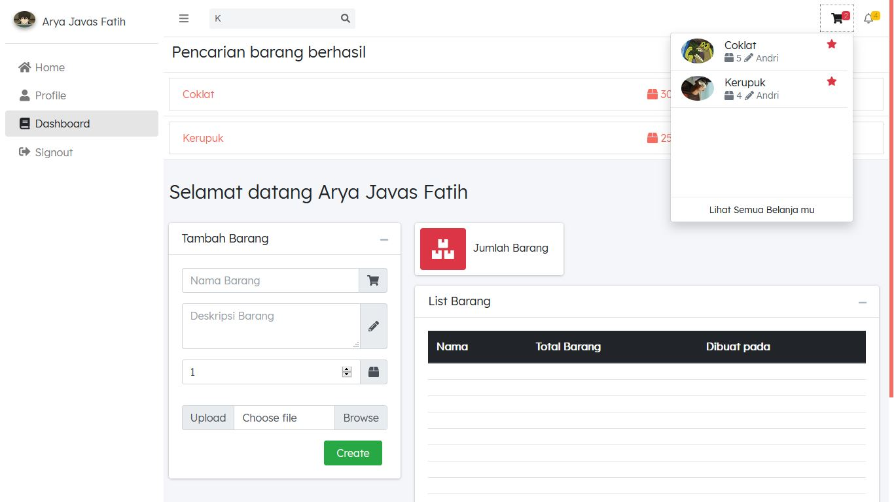
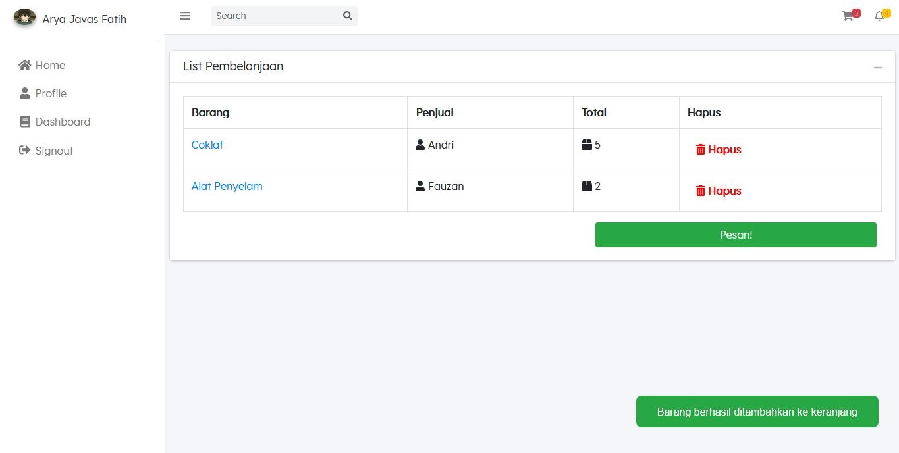

<h1 align="center">Aplikasi Toko Online</h1>
<h3 align="center">Build with NodeJS & Vue 3 </h3>


## Deskripsi
<p> Saya membuat aplikasi ini untuk tugas kampus 😄 tapi jika kalian ingin mencoba mengembangkannya, silahkan dinikmati 🥰 </p>

## Live Demo
<p>Masih tahap perkembangan 👷</p>
<h4>https://penjualan.digitalinteraktif.com/</h4>

## Screenshoot




## Setup Projek
<p>Silahkan dibuka terlebih dahulu terminalnya<p>
<h5>Pertama buatlah nama database "aplikasi_penjualan" lalu jalankan kode ini didalam terminal</h5>
 
```
cd api || Pindah halaman ke folder Node JS
npm run migrate:fresh || Membuat otomatis tabel ke dalam database aplikasi_penjualan
```

<h5>Buka kembali terminal, jalankan kode dibawah untuk menjalankan server API Node JS</h5>
 
```
cd api || Pindah halaman ke folder Node JS
npm run serve || Menjalankan server Node JS
```

<h5>Buka kembali terminal, jalankan kode dibawah untuk menjalankan serve Vue JS</h5>
 
```
cd client || Pindah halaman ke folder Vue JS
npm run serve || Menjalankan server Vue JS
```

<h3 align="center"> Selamat Mencoba 😸 </h3>